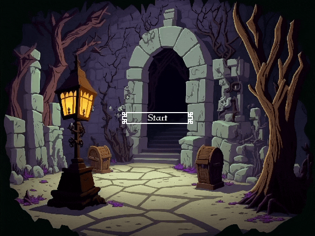

# Spielda

2D Topdown dungeon crawler developed as a means of learning gamedev related topics 

## Features

* Animation
* Collision detection
* Movement
* System for attaching sprites to another sprite (for example weapons)
* AI player detection and movement via [**roen**](https://github.com/J-Cieplinski/roen) implementation of A* algorithm
* Level loading using their json definitions
* Loading [**Tiled**](http://www.mapeditor.org/) maps via [**roen**](https://github.com/J-Cieplinski/roen) as entities

## Planned and in development
* Pre-rendering of map
* AI path smoothing
* Space partitioning for collision detection
* Lua scripting

## Tech stack

- C++23
- STL

### Dependencies
- [**roen**](https://github.com/J-Cieplinski/roen): framework devoloped alongside this project as a means of identifying and abstracting non-project specific code to reuse in later 2D projects
- [**entt**](https://github.com/skypjack/entt): header-only, tiny and easy to use library for game programming and much more written in modern C++.
- [**raylib**](https://github.com/raysan5/raylib): raylib is a simple and easy-to-use library to enjoy videogames programming.
- [**nlohmann_json**](https://github.com/nlohmann/json): json library

## Usage

### Use precompiled binaries (Linux only)

Download the current [**release**](https://github.com/J-Cieplinski/spielda/releases) for your system and run it.

### Compile from source yourself

Make sure you have CMake and compiler supporting C++23 standard for your system installed
1. Clone repository `git clone git@github.com:J-Cieplinski/spielda.git`
2. Init submodules `cd spielda && git submodule update --init --recursive`
2. Compile using cmake `cmake -Bbuild && cmake -DCMAKE_BUILD_TYPE=Release -Bbuild`
3. run `spielda` from within the same directory that `assets` folder resides

#### Disclaimer

This is all a work in progress, some things may not work as expected